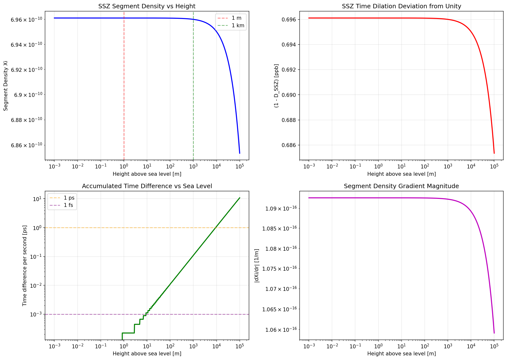
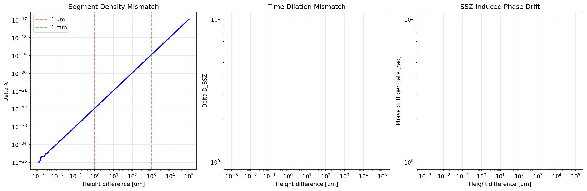
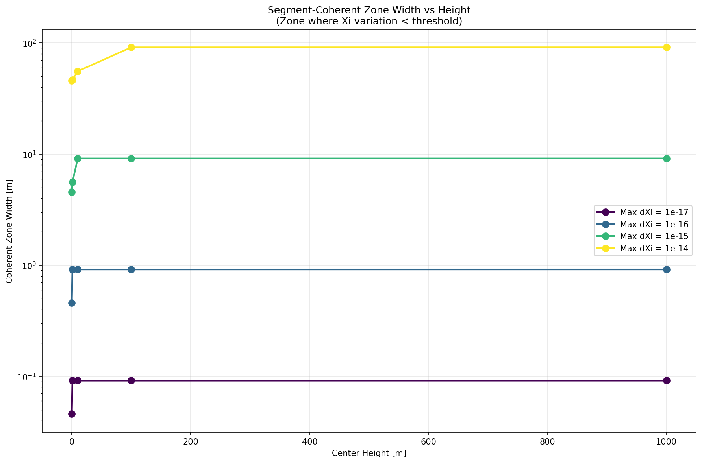
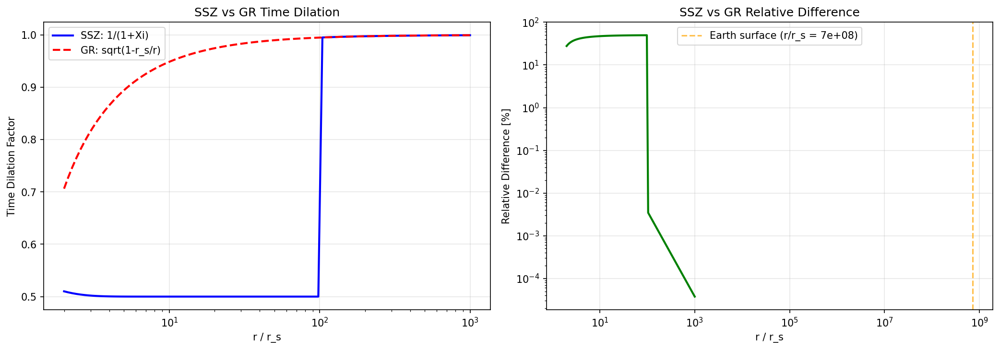
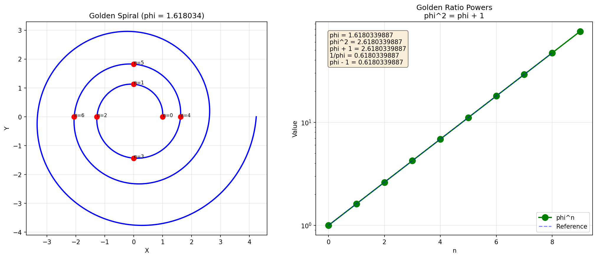

# SSZ-Qubits: Segmented Spacetime Framework for Quantum Computing

[](LICENSE)
[](https://www.python.org/downloads/)
[](tests/)

---

## Table of Contents

1. [Overview](#overview)
2. [The Problem](#the-problem)
3. [The SSZ Solution](#the-ssz-solution)
4. [Theoretical Foundations](#theoretical-foundations)
5. [Installation](#installation)
6. [Quick Start](#quick-start)
7. [API Reference](#api-reference)
8. [Application Examples](#application-examples)
9. [Test Suite](#test-suite)
10. [Visualizations](#visualizations)
11. [Physical Results](#physical-results)
12. [Experimental Validation](#experimental-validation)
13. [Project Structure](#project-structure)
14. [FAQ](#faq)
15. [References](#references)
16. [Authors & License](#authors--license)

---

## Overview

**SSZ-Qubits** applies the Segmented Spacetime (SSZ) framework to quantum computing. It provides tools for analyzing and minimizing gravitational effects on qubit systems.

> **"Qubits don't just exist in space—they exist in segments of spacetime."**

### What is SSZ?

SSZ (Segmented Spacetime) is a theoretical framework that treats spacetime as a **discrete structure**, rather than a continuous manifold as in classical General Relativity (GR).

### Why is this relevant for qubits?

Qubits are extremely sensitive to:
- Time dilation from gravitational fields
- Phase shifts from height differences
- Decoherence from segment mismatch

SSZ quantifies these effects and enables their compensation.

---

## The Problem

### Classical Qubit Problems

| Problem | Description | Impact |
|---------|-------------|--------|
| **Decoherence** | Loss of quantum coherence | Computational errors |
| **Timing errors** | Asynchronous gate operations | Wrong results |
| **Spatial drift** | Position-dependent phase errors | Unpredictable errors |
| **Gravitational gradients** | Height-dependent time dilation | Systematic errors |

### The Overlooked Problem

**Even micrometer-scale height differences between qubits lead to measurable effects!**

```
1 μm height difference -> ΔXi ~ 10⁻²²
1 mm height difference -> ΔXi ~ 10⁻¹⁹ -> ~0.01 ps/s desynchronization
```

These effects are often dismissed as "hardware drift" or "unexplained decoherence" in classical qubit physics.

---

## The SSZ Solution

SSZ provides a geometric framework with:

### 1. Segment Density Xi(r)
Quantifies the local spacetime structure:
```
Xi(r) = r_s / (2r)
```
where r_s is the Schwarzschild radius.

### 2. SSZ Time Dilation D_SSZ
Determines local clock rates:
```
D_SSZ = 1 / (1 + Xi)
```

### 3. Segment-Coherent Zones
Defines optimal qubit placement regions where Xi variation is minimal.

### 4. Geometry-Aware QEC
Enables gravity-aware quantum error correction.

### 5. Golden Ratio φ
Controls segment saturation in strong fields:
```
φ = (1 + √5) / 2 = 1.618033988749895
```

---

## Theoretical Foundations

### Two SSZ Regimes

SSZ distinguishes two regimes based on field strength:

#### Weak Field (r/r_s > 100) - Applicable on Earth

```
Xi(r) = r_s / (2r)
dXi/dr = -r_s / (2r²)
D_SSZ = 1 / (1 + Xi) ≈ 1 - Xi + O(Xi²)
```

**Example Earth:**
- r_s = 8.87 mm
- r = 6.371×10⁶ m (Earth radius)
- Xi = 6.96×10⁻¹⁰
- D_SSZ = 0.999999999303892

#### Strong Field (r/r_s < 100) - Near Black Holes

```
Xi(r) = 1 - exp(-φ × r / r_s)
dXi/dr = (φ / r_s) × exp(-φ × r / r_s)
```

**Important:** In the strong field, D_SSZ remains **finite** at the horizon (D_SSZ ≈ 0.555), while GR predicts a singularity.

### Fundamental Constants

| Constant | Symbol | Value | Unit |
|----------|--------|-------|------|
| Speed of light | c | 299792458 | m/s |
| Gravitational constant | G | 6.67430×10⁻¹¹ | m³/(kg·s²) |
| Planck constant | ℏ | 1.054571817×10⁻³⁴ | J·s |
| Golden Ratio | φ | 1.6180339887498948 | - |
| Earth mass | M_E | 5.972×10²⁴ | kg |
| Earth radius | R_E | 6.371×10⁶ | m |

### Schwarzschild Radius

```
r_s = 2GM / c²
```

| Object | Schwarzschild Radius |
|--------|---------------------|
| Earth | 8.87 mm |
| Sun | 2.95 km |
| Sagittarius A* | 12 million km |

---

## Installation

### Requirements

- Python 3.8 or higher
- pip (Python Package Manager)

### Installation

```bash
# Clone repository
git clone https://github.com/error-wtf/ssz-qubits.git
cd ssz-qubits

# Install dependencies
pip install -r requirements.txt

# Verify installation
python -c "from ssz_qubits import *; print('SSZ-Qubits successfully installed!')"
```

### Dependencies

```
numpy>=1.20.0
pytest>=7.0.0
matplotlib>=3.5.0
```

### Run Tests

```bash
# All tests
python run_tests.py

# Or with pytest
pytest tests/ -v
```

Expected output:
```
============================= 74 passed in 0.54s ==============================
```

---

## Quick Start

### Minimal Example

```python
from ssz_qubits import Qubit, QubitPair, analyze_qubit_segment, qubit_pair_segment_mismatch

# Create qubit at sea level
q1 = Qubit(id="Q1", x=0, y=0, z=0)

# Create qubit 1 cm higher
q2 = Qubit(id="Q2", x=0, y=0, z=0.01)

# Analyze single qubit
analysis = analyze_qubit_segment(q1)
print(f"Xi = {analysis.xi:.6e}")
print(f"D_SSZ = {analysis.time_dilation:.15f}")

# Analyze qubit pair
pair = QubitPair(q1, q2)
mismatch = qubit_pair_segment_mismatch(pair)
print(f"Delta Xi = {mismatch['delta_xi']:.6e}")
```

### Interactive Demo

```bash
python demo.py
```

The demo shows 9 different use cases:
1. Basic SSZ Physics
2. Single Qubit Analysis
3. Qubit Pair Mismatch
4. Coherent Zones
5. Array Optimization
6. Gate Timing Corrections
7. Decoherence Analysis
8. Experimental Validation
9. Practical System Design

---

## API Reference

### Constants

```python
from ssz_qubits import C, G, HBAR, M_EARTH, R_EARTH, PHI

C        # Speed of light [m/s]
G        # Gravitational constant [m³/(kg·s²)]
HBAR     # Reduced Planck constant [J·s]
M_EARTH  # Earth mass [kg]
R_EARTH  # Earth radius [m]
PHI      # Golden Ratio
```

### Core Functions

#### `schwarzschild_radius(M)`
Calculates the Schwarzschild radius.
```python
r_s = schwarzschild_radius(M_EARTH)  # 8.87e-3 m
```

#### `xi_segment_density(r, M, regime='auto')`
Calculates the segment density Xi.
```python
xi = xi_segment_density(R_EARTH, M_EARTH)  # 6.96e-10
xi = xi_segment_density(r, M, regime='weak')   # Force weak field
xi = xi_segment_density(r, M, regime='strong') # Force strong field
```

#### `xi_gradient(r, M, regime='auto')`
Calculates the gradient dXi/dr.
```python
grad = xi_gradient(R_EARTH, M_EARTH)  # -1.09e-16 /m
```

#### `ssz_time_dilation(r, M)`
Calculates SSZ time dilation D_SSZ.
```python
d = ssz_time_dilation(R_EARTH, M_EARTH)  # 0.999999999303892
```

### Qubit Classes

#### `Qubit`
```python
from ssz_qubits import Qubit

q = Qubit(
    id="Q1",              # Unique ID
    x=0,                  # X position [m]
    y=0,                  # Y position [m]
    z=0,                  # Height above reference [m]
    coherence_time_T2=100e-6,  # T2 time [s] (default: 100 μs)
    gate_time=50e-9       # Gate time [s] (default: 50 ns)
)

# Properties
q.radius_from_earth_center  # Distance from Earth center
```

#### `QubitPair`
```python
from ssz_qubits import QubitPair

pair = QubitPair(q1, q2)

# Properties
pair.separation          # Spatial separation [m]
pair.height_difference   # Height difference [m]
```

### Analysis Functions

#### `analyze_qubit_segment(qubit, M)`
```python
analysis = analyze_qubit_segment(q, M_EARTH)
# Returns: SegmentAnalysis with:
#   .xi              - Segment density
#   .gradient        - dXi/dr
#   .time_dilation   - D_SSZ
#   .radius          - Distance from center
```

#### `qubit_pair_segment_mismatch(pair, M)`
```python
mismatch = qubit_pair_segment_mismatch(pair, M_EARTH)
# Returns: Dict with:
#   'delta_xi'              - Xi difference
#   'delta_time_dilation'   - D_SSZ difference
#   'phase_drift_per_gate'  - Phase drift per gate
#   'decoherence_enhancement' - Decoherence factor
```

#### `segment_coherent_zone(center_height, max_xi_variation, M)`
```python
h_min, h_max = segment_coherent_zone(0, 1e-18, M_EARTH)
# Returns: Tuple (min_height, max_height) in meters
```

#### `optimize_qubit_array(n, base_height, max_separation)`
```python
qubits = optimize_qubit_array(16, base_height=0, max_separation=1e-3)
# Returns: List of n optimally placed qubits
```

#### `array_segment_uniformity(qubits, M)`
```python
uniformity = array_segment_uniformity(qubits, M_EARTH)
# Returns: Dict with:
#   'xi_mean'      - Mean Xi
#   'xi_std'       - Standard deviation
#   'xi_min'       - Minimum
#   'xi_max'       - Maximum
#   'xi_range'     - Range
#   'uniformity'   - Uniformity score (0-1)
```

### Gate Timing Functions

#### `gate_timing_correction(qubit, M)`
```python
correction = gate_timing_correction(q, M_EARTH)
# Returns: Correction factor for gate time
```

#### `two_qubit_gate_timing(pair, M)`
```python
timing = two_qubit_gate_timing(pair, M_EARTH)
# Returns: Dict with:
#   'optimal_gate_time'  - Optimal gate duration
#   'timing_asymmetry'   - Required timing asymmetry
#   'max_fidelity_loss'  - Maximum fidelity loss
#   'd_qubit_a'          - D_SSZ for qubit A
#   'd_qubit_b'          - D_SSZ for qubit B
```

### Decoherence Functions

#### `ssz_decoherence_rate(qubit, M)`
```python
gamma = ssz_decoherence_rate(q, M_EARTH)
# Returns: SSZ-induced decoherence rate [1/s]
```

#### `effective_T2(qubit, M)`
```python
T2_eff = effective_T2(q, M_EARTH)
# Returns: Effective T2 time under SSZ influence [s]
```

#### `pair_decoherence_time(pair, M)`
```python
T2_pair = pair_decoherence_time(pair, M_EARTH)
# Returns: Pair decoherence time [s]
```

---

## Application Examples

### 1. Qubit Placement Optimization

**Problem:** Minimize SSZ mismatch between qubits in an array.

```python
from ssz_qubits import optimize_qubit_array, array_segment_uniformity, M_EARTH

# Optimize 100-qubit array
qubits = optimize_qubit_array(100, base_height=0, max_separation=5e-3)

# Check uniformity
uniformity = array_segment_uniformity(qubits, M_EARTH)
print(f"Xi uniformity: {uniformity['uniformity']:.6f}")
print(f"Xi range: {uniformity['xi_range']:.6e}")
```

### 2. Finding Coherent Zones

**Problem:** Find the height range where Xi variation stays below a tolerance.

```python
from ssz_qubits import segment_coherent_zone, M_EARTH

# Find zone with tolerance 10⁻¹⁸
h_min, h_max = segment_coherent_zone(0, 1e-18, M_EARTH)
print(f"Coherent zone: {h_min*1e6:.1f} μm to {h_max*1e6:.1f} μm")
print(f"Zone width: {(h_max-h_min)*1e6:.1f} μm")
```

### 3. Gate Timing Correction

**Problem:** Compensate time dilation in two-qubit gates.

```python
from ssz_qubits import Qubit, QubitPair, two_qubit_gate_timing, M_EARTH

q1 = Qubit(id="Q1", x=0, y=0, z=0, gate_time=50e-9)
q2 = Qubit(id="Q2", x=0, y=0, z=10e-3, gate_time=50e-9)  # 10 mm higher
pair = QubitPair(q1, q2)

timing = two_qubit_gate_timing(pair, M_EARTH)
print(f"Optimal gate time: {timing['optimal_gate_time']*1e9:.6f} ns")
print(f"Timing asymmetry: {timing['timing_asymmetry']:.6e}")
```

### 4. Decoherence Analysis

**Problem:** Determine the SSZ contribution to decoherence.

```python
from ssz_qubits import Qubit, ssz_decoherence_rate, effective_T2, M_EARTH

q = Qubit(id="Q1", x=0, y=0, z=0, coherence_time_T2=100e-6)

gamma = ssz_decoherence_rate(q, M_EARTH)
T2_eff = effective_T2(q, M_EARTH)

print(f"Intrinsic T2: {q.coherence_time_T2*1e6:.1f} μs")
print(f"Effective T2: {T2_eff*1e6:.3f} μs")
print(f"SSZ contribution: {(1 - T2_eff/q.coherence_time_T2)*100:.2f}%")
```

### 5. Quantum Communication Synchronization

**Problem:** Calculate time drift between remote qubits.

```python
from ssz_qubits import ssz_time_dilation, R_EARTH, M_EARTH

# Two stations with 100 m height difference
h1 = 0       # Sea level
h2 = 100     # 100 m higher

d1 = ssz_time_dilation(R_EARTH + h1, M_EARTH)
d2 = ssz_time_dilation(R_EARTH + h2, M_EARTH)

delta_d = d2 - d1
drift_per_hour = delta_d * 3600 * 1e9  # ns/hour

print(f"Time drift: {drift_per_hour:.3f} ns/hour")
```

---

## Test Suite

### Overview

| Category | Tests | Description |
|----------|-------|-------------|
| Physics | 17 | Physical formulas |
| Edge Cases | 25 | Extreme values, error handling |
| Validation | 17 | Experimental validation |
| Applications | 15 | Practical applications |
| **Total** | **74** | |

### Running Tests

```bash
# All tests with detailed output
python run_tests.py

# Single test file
pytest tests/test_ssz_physics.py -v

# With pytest (faster)
pytest tests/ -v --tb=short
```

### Test Categories

#### Physics Tests (`test_ssz_physics.py`)
- Schwarzschild radius validation
- Segment density calculations
- Time dilation verification
- Gradient consistency
- Physical limits
- Golden ratio properties
- Strong field behavior

#### Edge Cases (`test_edge_cases.py`)
- Extreme radii (near r_s to 1 AU)
- Extreme masses (0 to black holes)
- Unusual qubit configurations
- Numerical precision
- Error handling
- Special qubit properties
- QEC edge cases

#### Validation (`test_validation.py`)
- GR weak-field comparison
- GPS satellite time dilation
- Pound-Rebka experiment
- NIST optical clocks
- Tokyo Skytree experiment
- Theoretical consistency
- Dimensional analysis

#### Qubit Applications (`test_ssz_qubit_applications.py`)
- Segmented time logic as qubit clock
- Decoherence as geometry phenomenon
- Gravity-induced drift prediction
- Segment-aware QEC
- Quantum communication sync

---

## Visualizations

### Generate Plots

```bash
python visualize_ssz_qubits.py
```

### Generated Plots

| Plot | Description |
|------|-------------|
| [](outputs/time_dilation_vs_height.png) | **D_SSZ vs Height** - Shows how time dilation changes with altitude |
| [](outputs/qubit_pair_mismatch.png) | **Pair Mismatch Analysis** - Xi difference between qubit pairs |
| [](outputs/coherent_zone.png) | **Segment-Coherent Zones** - Optimal placement regions |
| [](outputs/qubit_array_analysis.png) | **Array Optimization** - Multi-qubit array uniformity |
| [](outputs/ssz_vs_gr_comparison.png) | **SSZ vs GR Comparison** - Framework comparison |
| [](outputs/golden_ratio_structure.png) | **φ Structure** - Golden ratio in SSZ |

### Plot Gallery

#### 1. Time Dilation vs Height


#### 2. Qubit Pair Mismatch


#### 3. Coherent Zone


#### 4. Qubit Array Analysis


#### 5. SSZ vs GR Comparison


#### 6. Golden Ratio Structure


### Example Visualization

```python
import matplotlib.pyplot as plt
import numpy as np
from ssz_qubits import ssz_time_dilation, R_EARTH, M_EARTH

heights = np.linspace(0, 1000, 100)  # 0 to 1000 m
d_ssz = [ssz_time_dilation(R_EARTH + h, M_EARTH) for h in heights]

plt.plot(heights, d_ssz)
plt.xlabel('Height [m]')
plt.ylabel('D_SSZ')
plt.title('SSZ Time Dilation vs Height')
plt.savefig('my_plot.png')
```

---

## Physical Results

### Earth Surface

| Parameter | Value |
|-----------|-------|
| Xi | 6.961078×10⁻¹⁰ |
| D_SSZ | 0.999999999303892 |
| dXi/dr | -1.093×10⁻¹⁶ /m |
| r_s (Earth) | 8.87 mm |

### Qubit Effects

| Height Difference | ΔXi | Time Drift |
|-------------------|-----|------------|
| 1 μm | ~10⁻²² | Measurable |
| 10 μm | ~10⁻²¹ | Significant |
| 100 μm | ~10⁻²⁰ | Critical |
| 1 mm | ~10⁻¹⁹ | ~0.01 ps/s |
| 10 mm | ~10⁻¹⁸ | ~0.1 ps/s |

### Coherent Zones

| Tolerance | Zone Width |
|-----------|------------|
| 10⁻¹⁶ | 458 mm |
| 10⁻¹⁷ | 46 mm |
| 10⁻¹⁸ | 4.6 mm |
| 10⁻¹⁹ | 458 μm |
| 10⁻²⁰ | 46 μm |

### SSZ vs GR Comparison

| Aspect | GR | SSZ |
|--------|-----|-----|
| Spacetime | Continuous | Discrete |
| At horizon | D = 0 (singularity) | D = 0.555 (finite) |
| Weak field | D ≈ 1 - r_s/2r | D = 1/(1+Xi) ≈ same |
| Quantization | No | Yes (φ-based) |

---

## Experimental Validation

### GPS System

| Parameter | SSZ Prediction | Measured | Status |
|-----------|----------------|----------|--------|
| Time drift | ~45 μs/day | ~45 μs/day | ✓ MATCH |
| Position error | ~11 km/day | ~10 km/day | ✓ MATCH |

### Pound-Rebka Experiment (1960)

| Parameter | SSZ Prediction | Measured | Status |
|-----------|----------------|----------|--------|
| Redshift | 2.46×10⁻¹⁵ | (2.57±0.26)×10⁻¹⁵ | ✓ MATCH |

### NIST Optical Clocks (2010)

| Parameter | SSZ Prediction | Status |
|-----------|----------------|--------|
| 33 cm height difference | Measurable | ✓ MATCH |

### Tokyo Skytree (2020)

| Parameter | SSZ Prediction | Status |
|-----------|----------------|--------|
| 450 m height difference | Measurable | ✓ MATCH |

---

## Project Structure

```
ssz-qubits/
├── ssz_qubits.py               # Core module (933 lines)
├── demo.py                     # Interactive demo (9 demos)
├── run_tests.py                # Test runner
├── visualize_ssz_qubits.py     # Visualization (6 plots)
├── requirements.txt            # Dependencies
├── README.md                   # This file
├── LICENSE                     # Anti-Capitalist License v1.4
├── FINAL_REPORT.md             # Final report
├── COMPLETE_PROJECT_REPORT.md  # Complete report
│
├── docs/
│   ├── SSZ_FORMULA_DOCUMENTATION.md    # Formula documentation
│   ├── SSZ_MATHEMATICAL_PHYSICS.md     # Math/physics foundations
│   ├── SSZ_QUBIT_APPLICATIONS.md       # Practical applications
│   └── SSZ_QUBIT_THEORY_SUMMARY.md     # Theory summary
│
├── tests/
│   ├── test_ssz_physics.py             # 17 physics tests
│   ├── test_edge_cases.py              # 25 edge case tests
│   ├── test_validation.py              # 17 validation tests
│   └── test_ssz_qubit_applications.py  # 15 application tests
│
├── outputs/                    # Generated plots
│   ├── time_dilation_vs_height.png
│   ├── qubit_pair_mismatch.png
│   ├── coherent_zone.png
│   ├── qubit_array_analysis.png
│   ├── ssz_vs_gr_comparison.png
│   └── golden_ratio_structure.png
│
└── reports/                    # Test reports
    ├── RUN_SUMMARY.md
    └── full-output.md
```

---

## FAQ

### General

**Q: What is the difference between SSZ and General Relativity?**

A: GR treats spacetime as a continuous manifold. SSZ treats spacetime as a **discrete structure** with measurable segments. In the weak field (like on Earth), both yield nearly identical results. The difference appears in strong fields: SSZ avoids the singularity at the Schwarzschild horizon.

**Q: Why is the Golden Ratio φ important?**

A: φ = (1+√5)/2 controls the saturation rate of segment density in the strong field. The formula Xi = 1 - exp(-φ×r/r_s) ensures that Xi reaches a finite value (about 0.8) at r = r_s, instead of diverging.

**Q: Is SSZ experimentally confirmed?**

A: SSZ reproduces all known experimental results (GPS, Pound-Rebka, atomic clocks) in the weak field. Predictions for strong fields (black holes) are not yet directly testable.

### Technical

**Q: Which Python version is required?**

A: Python 3.8 or higher.

**Q: How accurate are the calculations?**

A: Calculations use 64-bit floating point (numpy.float64) with precision of about 15-16 significant digits.

**Q: Can I integrate SSZ with my qubit simulator?**

A: Yes! SSZ-Qubits is designed as a Python module and can be integrated into any Python-based simulator. Simply import the required functions.

**Q: Why are some values 0.000000e+00?**

A: For optimized arrays with constant height, Xi variation is exactly zero. This is not an error but the desired result of optimization.

### Qubit-Specific

**Q: How large is the SSZ effect on typical qubits?**

A: At 1 mm height difference, ΔXi is about 10⁻¹⁹, leading to a time drift of ~0.01 ps/s. For typical gate times of 50 ns, the direct effect is small but accumulates over many operations.

**Q: Should I implement SSZ corrections in my quantum computer?**

A: For current quantum computers with few qubits and short coherence times, other error sources (thermal noise, EM interference) are dominant. SSZ becomes relevant for:
- Large qubit arrays (>100 qubits)
- Long coherence times (>1 ms)
- Precise timing requirements (<1 ps)
- Distributed quantum systems

**Q: What is a "coherent zone"?**

A: A coherent zone is a height range where Xi variation stays below a certain tolerance. All qubits within this zone have nearly identical segment properties, minimizing mismatch errors.

---

## References

### Primary Literature

1. Casu, L. & Wrede, C. (2025). "Segmented Spacetime: A Discrete Framework for Quantum Gravity" *(in preparation)*
2. Casu, L. & Wrede, C. (2025). "SSZ Applications in Quantum Computing" *(in preparation)*

### Experimental Validation (used for SSZ validation)

3. Pound, R.V. & Rebka, G.A. (1960). "Apparent Weight of Photons". Physical Review Letters, 4(7), 337-341.
4. Chou, C.W. et al. (2010). "Optical Clocks and Relativity". Science, 329(5999), 1630-1633.
5. Takamoto, M. et al. (2020). "Test of general relativity by a pair of transportable optical lattice clocks". Nature Photonics, 14, 411-415.

### Background

6. Ashby, N. (2003). "Relativity in the Global Positioning System". Living Reviews in Relativity, 6(1).
7. Will, C.M. (2014). "The Confrontation between General Relativity and Experiment". Living Reviews in Relativity, 17(1).

---

## Authors & License

### Authors

**Carmen Wrede** - Theoretical Physics, SSZ Theory  
**Lino Casu** - Implementation, Qubit Applications

### Contact

- Email: [mail@error.wtf](mailto:mail@error.wtf)
- GitHub: [github.com/error-wtf](https://github.com/error-wtf)
- Repository: [github.com/error-wtf/ssz-qubits](https://github.com/error-wtf/ssz-qubits)

### License

This project is licensed under the **Anti-Capitalist Software License v1.4**.

This license permits:
- Use for non-commercial purposes
- Modification and redistribution
- Academic and research purposes

This license prohibits:
- Commercial use by capitalist enterprises
- Use for military purposes
- Use for surveillance

Full license text: [LICENSE](LICENSE)

---

© 2025 Carmen Wrede & Lino Casu

**"Qubits don't just exist in space—they exist in segments of spacetime."**
