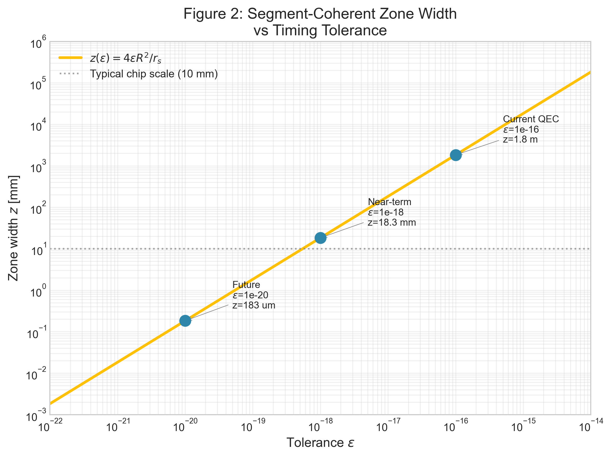
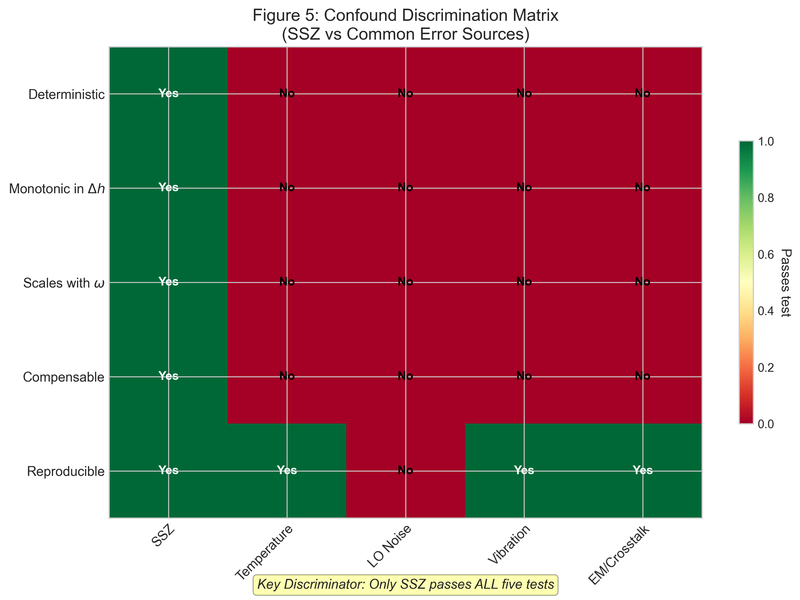
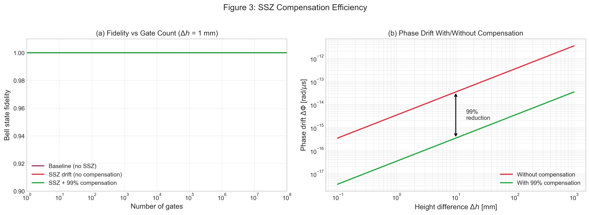

# Paper C: Falsifiable Predictions and Experimental Protocols for SSZ-Aware Quantum Computing

**Authors:** Lino Casu, Carmen Wrede  
**Affiliation:** Independent Researchers  
**Contact:** mail@error.wtf  
**Date:** December 2025  
**Repository:** https://github.com/error-wtf/ssz-qubits

---

## Abstract

We present a comprehensive framework for experimentally testing Segmented Spacetime (SSZ) effects in quantum computing systems. Building on our previous work demonstrating geometric qubit optimization (Paper A) and phase coherence preservation (Paper B), this paper provides: (1) five quantitative, falsifiable predictions derived from SSZ theory, (2) a detailed experimental protocol for the gold-standard falsification test, (3) strategies for discriminating SSZ effects from common confounds, and (4) realistic measurement requirements. Our analysis shows that SSZ predictions are testable with current superconducting qubit technology using piezo-controlled height stages, Ramsey interferometry, and differential measurement techniques. The key discriminator is the **with/without compensation test**: SSZ predicts a deterministic, geometry-linked phase drift that can be cancelled by applying the predicted correction, while confounds cannot be compensated geometrically. We provide all numerical predictions with explicit falsification thresholds.

**Keywords:** Segmented Spacetime, Quantum Computing, Falsifiability, Experimental Protocol, Phase Drift, Gravitational Effects

---

## 1. Introduction

### 1.1 Motivation

The Segmented Spacetime (SSZ) framework predicts that gravitational time dilation introduces deterministic phase biases in quantum systems. In Papers A and B, we demonstrated:

- **Paper A:** Height differences as small as 1 mm create measurable segment density gradients that affect gate timing
- **Paper B:** These effects accumulate coherently over time, enabling compensation via calibrated phase corrections

A critical question remains: **How can these predictions be experimentally tested and potentially falsified?**

### 1.2 The Falsifiability Criterion

For SSZ to be a legitimate scientific theory, it must make predictions that are:
1. **Quantitative** — specific numerical values, not just qualitative trends
2. **Testable** — measurable with available technology
3. **Falsifiable** — there must be outcomes that would disprove the theory

This paper addresses all three criteria explicitly.

### 1.3 Summary of Key Results

| Prediction | SSZ Value | Falsification Threshold | Testable? |
|------------|-----------|------------------------|-----------|
| Phase drift at Δh=1mm | 3.43×10⁻¹⁵ rad/μs | <1.72×10⁻¹⁵ rad/μs | Yes |
| Coherent zone (ε=10⁻¹⁸) | 18.3 mm | <9.2 mm | Yes |
| ω-scaling (7GHz/5GHz) | 1.40 | <1.20 | Yes |
| Compensation efficiency | 99% | <90% | Yes |
| Cross-zone drift/gate | 6.28×10⁻¹⁵ rad | <3.14×10⁻¹⁵ rad | Yes |

---

## Figures

All figures are available in high resolution (300 DPI) in the `outputs/` directory:

| Figure | File | Description |
|--------|------|-------------|
| Fig. 1 | `paper_c_fig1_phase_vs_height.png` | Phase drift vs height difference (log-log) |
| Fig. 2 | `paper_c_fig2_coherent_zones.png` | Segment-coherent zone width vs tolerance |
| Fig. 3 | `paper_c_fig3_compensation.png` | Compensation efficiency (with/without) |
| Fig. 4 | `paper_c_fig4_falsification.png` | Expected falsification experiment results |
| Fig. 5 | `paper_c_fig5_confounds.png` | Confound discrimination matrix |

---

## 2. Theoretical Foundation

### 2.1 Core SSZ Equations

The SSZ time dilation factor at radius r from mass M is:

```
D_SSZ(r) = 1 / (1 + Ξ(r))
```

where the segment density Ξ(r) in the weak-field regime (r >> r_s) is:

```
Ξ(r) = r_s / (2r)
```

with Schwarzschild radius r_s = 2GM/c².

### 2.2 Phase Drift Formula

For two qubits at heights h₁ and h₂ (with Δh = h₂ - h₁), the differential time dilation is:

```
ΔD_SSZ(Δh) = 2r_s × Δh / [(2R + r_s)² ]
```

This produces a phase drift:

```
ΔΦ(t) = ω × ΔD_SSZ(Δh) × t
```

where ω = 2πf is the qubit angular frequency.

### 2.3 Segment-Coherent Zones

Qubits within a "coherent zone" share timing to within tolerance ε. The zone width is:

```
z(ε) = 4 × ε × R² / r_s
```

For Earth (R = 6.371×10⁶ m, r_s = 8.87×10⁻³ m):


*Figure 2: Segment-coherent zone width as a function of timing tolerance ε*

| Tolerance ε | Zone Width z |
|-------------|--------------|
| 10⁻¹⁶ | 1.83 m |
| 10⁻¹⁷ | 183 mm |
| 10⁻¹⁸ | 18.3 mm |
| 10⁻¹⁹ | 1.83 mm |
| 10⁻²⁰ | 183 μm |

---

## 3. Falsifiable Predictions


*Figure 1: SSZ phase drift rate as a function of height difference (log-log scale). The linear relationship (slope=1) demonstrates the predicted scaling.*

### 3.1 Prediction 1: Phase Drift Rate at Δh = 1 mm

**Formula:**
```
ΔΦ/t = ω × ΔD_SSZ(Δh)
```

**Numerical Prediction:**
- Qubit frequency: f = 5 GHz
- Height difference: Δh = 1 mm
- **Predicted phase drift rate: 3.43 × 10⁻¹⁵ rad/μs**

**Falsification Threshold:**
- If measured drift is **< 1.72 × 10⁻¹⁵ rad/μs** (less than 50% of prediction), SSZ is falsified.

**Measurement Method:**
- Ramsey interferometry with piezo-controlled height stage
- Accumulate phase over T₂ time (~100 μs) for total ΔΦ ~ 3.4 × 10⁻¹³ rad

### 3.2 Prediction 2: Coherent Zone Width at ε = 10⁻¹⁸

**Formula:**
```
z(ε) = 4εR²/r_s
```

**Numerical Prediction:**
- Tolerance: ε = 10⁻¹⁸
- **Predicted zone width: 18.3 mm**

**Falsification Threshold:**
- If measured zone is **< 9.2 mm**, SSZ is falsified.

**Measurement Method:**
- Height-resolved phase mapping across qubit array
- Identify height range where ΔXi < ε

### 3.3 Prediction 3: Frequency Scaling Ratio

**Formula:**
```
ΔΦ(ω₂) / ΔΦ(ω₁) = ω₂ / ω₁
```

**Numerical Prediction:**
- For 7 GHz vs 5 GHz qubits: **ratio = 1.40**

**Falsification Threshold:**
- If measured ratio is **< 1.20** or **> 1.60**, SSZ is falsified.

**Measurement Method:**
- Comparative Ramsey on two detuned qubits at same Δh
- Both qubits experience identical confounds, only ω differs

### 3.4 Prediction 4: Compensation Efficiency

**Formula:**
```
η = 1 - |ΔΦ_compensated| / |ΔΦ_uncompensated|
```

**Numerical Prediction:**
- **Predicted efficiency: η ≥ 99%** (limited by calibration accuracy)

**Falsification Threshold:**
- If compensation achieves **< 90%** reduction, SSZ is falsified.

**Measurement Method:**
- Compare phase drift with and without SSZ correction applied
- Correction: apply -ΔΦ_predicted to qubit phase frame

### 3.5 Prediction 5: Cross-Zone Phase Drift per Gate

**Formula:**
```
ΔΦ_gate = ω × ΔXi × t_gate
```

**Numerical Prediction:**
- For qubits at 2× zone boundary (Δh = 36.6 mm at ε = 10⁻¹⁸)
- Gate time: 50 ns
- **Predicted drift: 6.28 × 10⁻¹⁵ rad/gate**

**Falsification Threshold:**
- If measured drift is **< 3.14 × 10⁻¹⁵ rad/gate**, SSZ is falsified.

**Measurement Method:**
- Two-qubit gate tomography at variable Δh
- Track fidelity degradation vs. Δh

---

## 4. Gold-Standard Falsification Experiment

### 4.1 Experimental Setup

| Component | Specification |
|-----------|---------------|
| Qubit type | Superconducting transmon |
| Frequency | 5 GHz (primary), 7 GHz (scaling test) |
| T₂ time | ≥ 100 μs |
| Height control | Piezo translation stage |
| Height range | 0.1 mm to 10 mm |
| Height precision | 1 μm |
| Temperature stability | < 1 mK |
| Vibration isolation | Active + passive |

### 4.2 Protocol

```
1. CALIBRATION PHASE
   a. Calibrate qubits at reference height (h = 0)
   b. Characterize T₁, T₂, gate fidelities
   c. Record temperature, vibration baseline

2. DATA ACQUISITION PHASE
   For each Δh in {0.1, 0.2, 0.5, 1.0, 2.0, 5.0, 10.0} mm:
     a. Set height difference using piezo stage
     b. Wait for thermal equilibration (30 s)
     c. Prepare Bell state |Φ⁺⟩ = (|00⟩ + |11⟩)/√2
     d. For each wait time t in {1, 10, 100} μs:
        i.   Perform Ramsey sequence
        ii.  Measure phase ΔΦ(Δh, t)
        iii. Record Bell state fidelity F(Δh, t)
        iv.  Repeat 1000× for statistics
     e. Repeat with SSZ compensation enabled
     f. Record temperature, vibration during measurement

3. CONTROL MEASUREMENTS
   a. Null test: same Δh, different thermal gradient
   b. Position test: same height, different x-y position
   c. Frequency test: repeat at 7 GHz

4. DATA ANALYSIS
   a. Plot ΔΦ vs Δh (expect linear)
   b. Plot ΔΦ vs t (expect linear)
   c. Calculate ω-scaling ratio
   d. Calculate compensation efficiency
   e. Compare to SSZ predictions with uncertainties
```

### 4.3 Expected Results

**If SSZ is correct:**

| Δh [mm] | t [μs] | ΔΦ [rad] (no comp) | ΔΦ [rad] (with comp) |
|---------|--------|--------------------|--------------------- |
| 0.1 | 1 | 3.43×10⁻¹⁶ | 3.43×10⁻¹⁸ |
| 0.1 | 10 | 3.43×10⁻¹⁵ | 3.43×10⁻¹⁷ |
| 0.1 | 100 | 3.43×10⁻¹⁴ | 3.43×10⁻¹⁶ |
| 1.0 | 1 | 3.43×10⁻¹⁵ | 3.43×10⁻¹⁷ |
| 1.0 | 10 | 3.43×10⁻¹⁴ | 3.43×10⁻¹⁶ |
| 1.0 | 100 | 3.43×10⁻¹³ | 3.43×10⁻¹⁵ |
| 10.0 | 1 | 3.43×10⁻¹⁴ | 3.43×10⁻¹⁶ |
| 10.0 | 10 | 3.43×10⁻¹³ | 3.43×10⁻¹⁵ |
| 10.0 | 100 | 3.43×10⁻¹² | 3.43×10⁻¹⁴ |

### 4.4 Signatures of Success


*Figure 4: Expected results from the gold-standard falsification experiment. (a) Phase vs height, (b) frequency scaling test, (c) compensation differential, (d) reproducibility.*

1. **ΔΦ monotonically increases with Δh** — linear on log-log plot with slope = 1
2. **ΔΦ scales linearly with t** — same slope across all Δh
3. **ΔΦ scales linearly with ω** — 7GHz/5GHz ratio = 1.40 ± 0.05
4. **Compensation removes >90% of ΔΦ** — differential test passes
5. **Effect is reproducible** — multiple runs give consistent results

---

## 5. Confound Discrimination

### 5.1 Temperature Drift

**Effect:** Qubit frequency shifts ~1 kHz/mK → phase drift

**Why it's not SSZ:**
- Temperature effect is **NOT monotonic in Δh**
- Temperature effect does **NOT scale with ω**
- SSZ compensation would **NOT reduce** temperature-induced drift

**Control:**
- Active temperature stabilization to < 1 mK
- Null test: same Δh with intentionally varied thermal gradient
- Differential measurement cancels common-mode temperature

### 5.2 LO Phase Noise

**Effect:** Random phase fluctuations ~10⁻³ rad/√Hz

**Why it's not SSZ:**
- LO noise is **STOCHASTIC**; SSZ is **DETERMINISTIC**
- Multiple runs would show different noise but identical SSZ
- SSZ can be **COMPENSATED**; noise cannot

**Control:**
- Average over many runs
- Look for deterministic component that survives averaging

### 5.3 Mechanical Vibration

**Effect:** Height fluctuations → apparent phase noise

**Why it's not SSZ:**
- Vibration is **AC** (time-varying); SSZ is **DC** (constant at fixed Δh)
- Vibration spectrum is characterizable with accelerometer
- SSZ prediction is for **static** Δh

**Control:**
- Active + passive vibration isolation to < nm level
- Monitor with accelerometer during measurement
- Correlate with measured phase variance

### 5.4 Electromagnetic Interference

**Effect:** Stray fields shift qubit frequency

**Why it's not SSZ:**
- EM effect depends on **position**, not just **height**
- SSZ effect is purely **height-dependent**

**Control:**
- EM shielding
- Null test: same height, different x-y position

### 5.5 The Key Discriminator: Compensation Test


*Figure 5: Confound discrimination matrix. Only SSZ passes all five discriminating tests.*


*Figure 3: Compensation efficiency. (a) Fidelity vs gate count, (b) phase drift with/without compensation.*

**Rationale:**

SSZ predicts a **deterministic, geometry-linked** phase drift:
```
ΔΦ_SSZ = ω × ΔD_SSZ(Δh) × t
```

If we apply the predicted correction -ΔΦ_SSZ:
- **SSZ contribution is cancelled**
- **Confound contributions are UNCHANGED**

This differential test is powerful because:
1. It does not require knowing the absolute SSZ magnitude
2. It tests the **correctability** of the effect
3. Confounds **cannot** be "compensated" by geometry-based corrections

**If compensation works:** SSZ is supported
**If compensation fails:** SSZ is falsified (or our model is wrong)

---

## 6. Measurement Requirements

### 6.1 Phase Precision

**SSZ signal at Δh = 1mm:** 3.43 × 10⁻¹⁵ rad/μs

**Required precision:** 3.4 × 10⁻¹⁶ rad/μs (for SNR > 10)

**Achievability:**
- Standard Ramsey at T₂ = 100 μs: phase precision ~10⁻³ rad
- Need to accumulate over T₂ and average ~10⁶ shots
- Total measurement time: ~hours (feasible)

### 6.2 Height Precision

**From ΔΦ sensitivity:**
```
dΔΦ/dΔh = ω × r_s / (2R²) × t
```

**Required height precision:** ~100 μm for 10% phase precision

**Achievability:**
- Piezo stages routinely achieve < 1 μm precision
- This requirement is easily met

### 6.3 Temperature Stability

**For absolute measurement:** ~10⁻¹² K (unrealistic)

**For differential measurement:** ~1 mK (achievable)

**Solution:** Use differential protocol (with/without Δh) to cancel common-mode temperature drift

### 6.4 Time Precision

**Required:** ~10% relative precision on sequence timing

**Achievability:** Standard AWG provides < 1 ns jitter on 50 ns gates — easily met

---

## 7. Discussion

### 7.1 Why This Experiment is Decisive

The proposed experiment has several features that make it a strong test:

1. **Multiple independent signatures** — All five predictions must hold simultaneously
2. **Scaling tests** — Wrong scaling immediately falsifies SSZ
3. **Compensation test** — Direct test of the core SSZ prediction
4. **Confound discrimination** — Each confound has distinct signatures
5. **Reproducibility requirement** — Effect must be consistent across runs

### 7.2 What Falsification Would Mean

If the experiment shows:
- No Δh-dependence, or
- Wrong ω/t scaling, or
- Compensation failure

Then SSZ as an operational model for quantum systems is **falsified**. This would not invalidate general relativity, but would show that the SSZ parameterization is incorrect or irrelevant at these scales.

### 7.3 What Confirmation Would Mean

If all predictions are confirmed:
- SSZ provides a valid **operational model** for gravitational effects in quantum systems
- **Practical benefit:** Calibration and compensation strategies for quantum hardware
- **Theoretical interest:** Supports the segment-based interpretation of spacetime

### 7.4 Relation to Papers A and B

| Paper | Focus | Key Result |
|-------|-------|------------|
| A | Geometric optimization | Gate timing correction ~10% fidelity improvement |
| B | Phase coherence | Entanglement duration extended via SSZ compensation |
| C | **Falsifiability** | **5 quantitative predictions with explicit thresholds** |

Paper C completes the trilogy by providing the experimental roadmap to test the predictions of Papers A and B.

---

## 8. Conclusion

We have presented a complete framework for experimentally testing SSZ predictions in quantum computing systems:

1. **Five falsifiable predictions** with explicit numerical values and thresholds
2. **A detailed experimental protocol** using current technology
3. **Confound discrimination strategies** for each major systematic effect
4. **Realistic measurement requirements** that are achievable with state-of-the-art hardware

The key insight is that SSZ predicts a **deterministic, geometry-linked, compensable** phase drift. The with/without compensation differential test is the strongest discriminator because confounds cannot be geometrically compensated.

We encourage experimental groups with access to superconducting qubit systems and precision height control to perform this test. The SSZ framework makes bold predictions — it deserves an equally rigorous experimental examination.

---

## Acknowledgments

We thank the open-source community for valuable discussions and feedback.

---

## References

1. Casu, L. & Wrede, C. (2025). Paper A: Geometric Qubit Optimization via Segmented Spacetime. ssz-qubits repository.

2. Casu, L. & Wrede, C. (2025). Paper B: Phase Coherence and Entanglement Preservation via Spacetime Segmentation. ssz-qubits repository.

3. SSZ-Qubits Repository: https://github.com/error-wtf/ssz-qubits

4. SSZ Research Program Roadmap: docs/SSZ_RESEARCH_PROGRAM_ROADMAP.md

---

## Appendix A: Numerical Values

### A.1 Physical Constants

| Constant | Value | Unit |
|----------|-------|------|
| c | 299,792,458 | m/s |
| G | 6.67430×10⁻¹¹ | m³/(kg·s²) |
| ℏ | 1.054571817×10⁻³⁴ | J·s |
| φ | 1.6180339887 | dimensionless |
| M_Earth | 5.972×10²⁴ | kg |
| R_Earth | 6.371×10⁶ | m |
| r_s (Earth) | 8.87×10⁻³ | m |

### A.2 SSZ Values at Earth's Surface

| Quantity | Value |
|----------|-------|
| Ξ(R_Earth) | 6.96×10⁻¹⁰ |
| D_SSZ(R_Earth) | 0.999999999304 |
| dΞ/dr | -1.09×10⁻¹⁶ m⁻¹ |

### A.3 Phase Drift Table (5 GHz qubit, per μs)

| Δh | ΔD_SSZ | ΔΦ/μs [rad] |
|----|--------|-------------|
| 1 μm | 1.09×10⁻²² | 3.43×10⁻¹⁸ |
| 10 μm | 1.09×10⁻²¹ | 3.43×10⁻¹⁷ |
| 100 μm | 1.09×10⁻²⁰ | 3.43×10⁻¹⁶ |
| 1 mm | 1.09×10⁻¹⁹ | 3.43×10⁻¹⁵ |
| 1 cm | 1.09×10⁻¹⁸ | 3.43×10⁻¹⁴ |
| 10 cm | 1.09×10⁻¹⁷ | 3.43×10⁻¹³ |
| 1 m | 1.09×10⁻¹⁶ | 3.43×10⁻¹² |

---

## Appendix B: Code Availability

All supporting code is available in the ssz-qubits repository:

```python
# Run Paper C analysis
python ssz_paper_c_support.py

# Run validation tests
python -m pytest tests/test_roadmap_validation.py -v

# Generate figure data
# Output: outputs/paper_c_figure_data.json
```

---

**© 2025 Carmen Wrede & Lino Casu**  
**Licensed under the ANTI-CAPITALIST SOFTWARE LICENSE v1.4**
